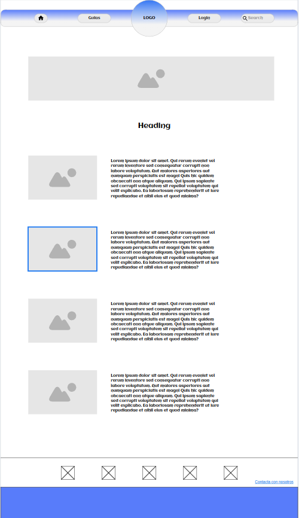
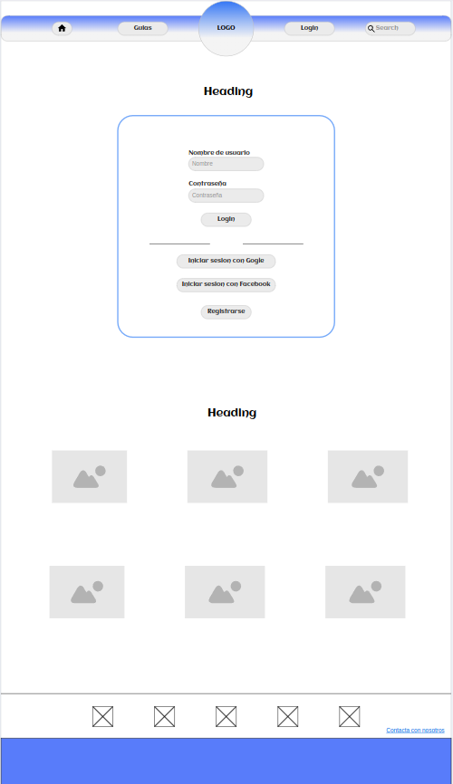
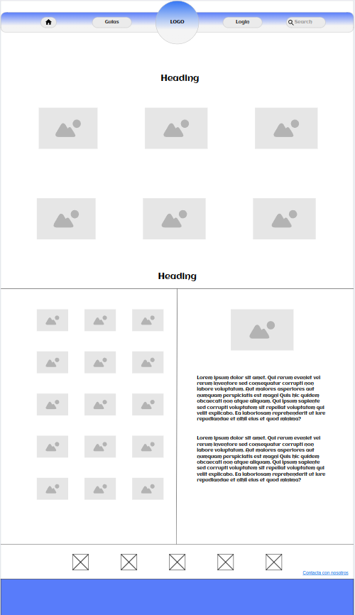
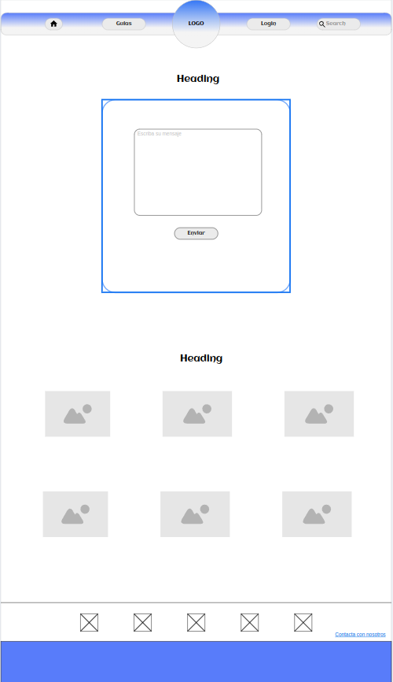

### Actividad 3 - Mockup
### Crear las maquetas (mockups) de las páginas del sitio web elegido en la actividad anterior (Actividad 2). Usar una herramienta tal y como Balsamiq (tb puede ser cualquier otra herramienta).

**Página inicial**

**Página de inicio de sesión**

**Página de guias**

**Página de contacto**

