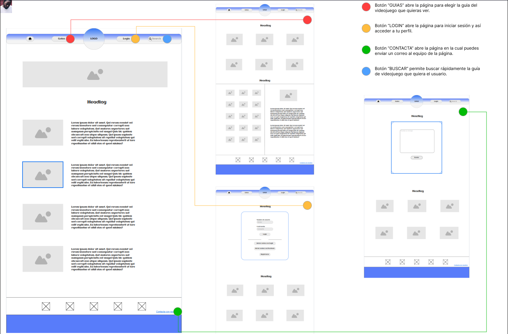

### Actividad 4
### Crear un wireframe que muestre el wireflow del sitio web elegido en la actividad anterior (Actividad 2). Se debe usar un software para ellos (Puedes elegir uno de entre los mostrados en el tema).

Como se puede observar en la imagen, tenemos un wireflow básico en el que al presionar distintos botones iremos navegando por las distintas páginas.  
La pagina mas a la izquierda es la página inicial, pulsando el botón sobre guias, login o contacta con nosotros, iremos a sus respectivas páginas, esos botones también están compartidos en las demás páginas permitiendo en todo momento navegar a todas las páginas desde cualquiera de ellas.